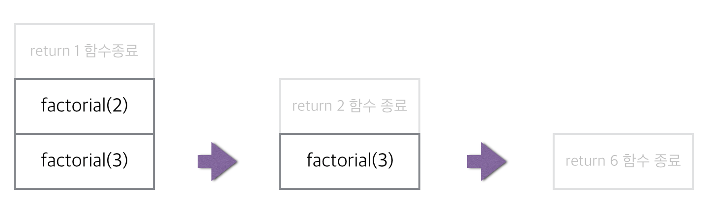

# Recursion

**재귀** : 자기 자신을 호출하는 함수
**함수 안에 있는 함수를 호출했을 경우, 안에 있는 함수가 끝나야 상위에 있는 함수도 종료가 된다.**

`iterative(for문)`  vs  `recursion(재귀)`


factorial을 재귀로 푼다고 해보자.

 factorial(3) = 3 * 2 * 1; === 3 * factorial(2);

 factorial(2) = 2 * 1; === 2 * factorial(1);

 factorial(1) = 1;

  ...

 factorial(n) = n * factorial(n - 1);

```js
function factorial(n) {
  return n * factorial(n - 1);
}
```

이렇게 쓸 수 있게 되는데, 하나씩 따지면서 잘 돌아가는지 확인 해보면

```js
function factorial(n) {
  return n * factorial(n - 1);
}

factorial(3);

// n = 3 이 되고, return 3 * factorial(2);
// 이때 n = 3 일때의 함수는 대기를 타게 되고 factorial(2) 가 실행된다. 
// n = 2, return 2 * factorial(1);
// n = 2 일때의 함수도 대기를 타게 되고 factorial(1) 이 실행된다.
// n = 1, reutrn 1 * factorial(0); 
// n = 0, return 0 * factorial(-1);
// 함수 안에서 함수를 호출 했을 경우 안에 있는 함수가 종료되어야 상위의 함수도 종료 될 수 있다.
// ...
// 결국 무한 루프게 빠지게 된다..
```

이럴때 Base case, Termination case를 사용해서 재귀에서 빠져나올 수 있는 구문을 만들어 줘야한다.

```js
function factorial(n) {
  // Base case, Termination case
  if(n === 1) {
    return 1;
  }
  
  return n * factorial(n - 1);
}
```

stack = "쌓여있는" stack 구조

함수를 실행하는 걸 stack 이라고 생각해보자, 


factorial(3) 함수를 실행하게 되면 하나의 stack 이 생기게된다.
factorial(2) 함수를 실행한다면 factorial(3) 위로 factorial(2) stack이 쌓이게 된다.
factorial(3) 함수는 이제 factorial(2) 함수가 종료되기 전까지 빠져 나오지 못하게 되는 것이다.



n 이 1인 factorial 함수가 실행이 되고, base case를 만나게 되어 더이상 자신을 호출 하지 않고 1이라는 값을 반환하고 종료되므로 stack이 쌓이지 않는다.


*재귀를 많이 타야 할 경우 계속 stack을 쌓는 것이기 때문에 구동이 안될 수 있으므로 그럴 경우는 iterative로 변경해야한다*

일반적인 경우 가독성 면으로는 재귀가 낫다.


